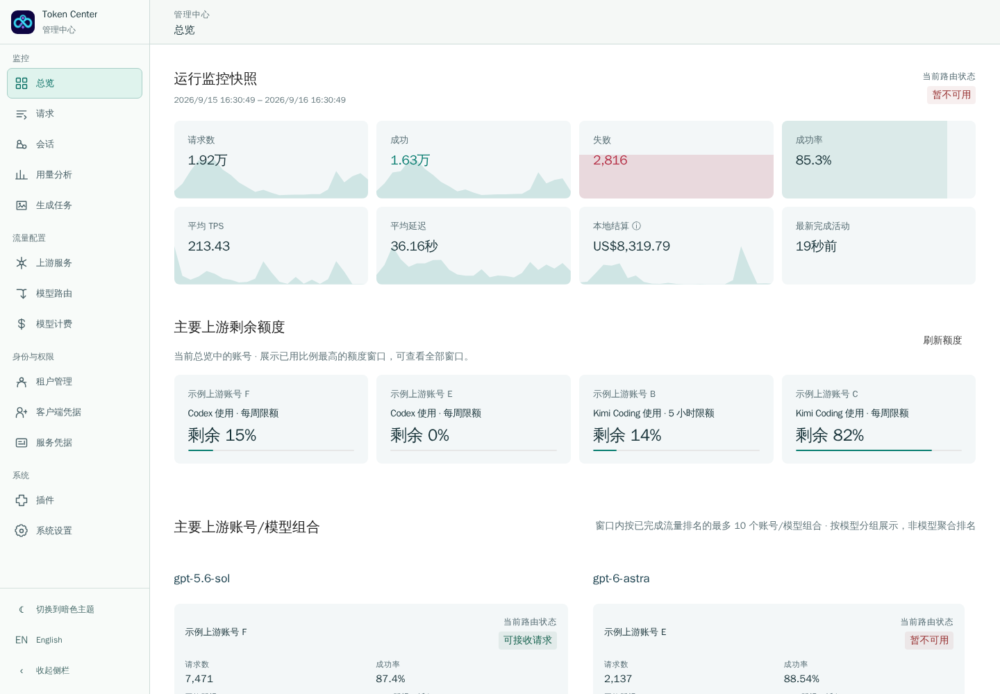
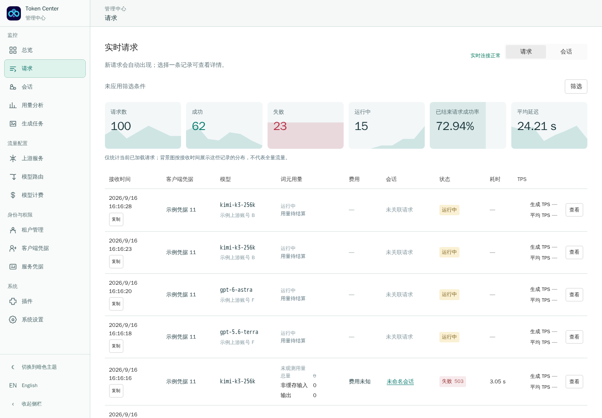
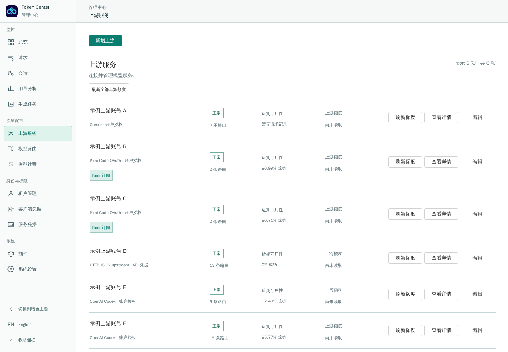

# Memeloop Token Center

简体中文 · [English](README.md)

Memeloop Token Center（MTC）是面向团队的多模型 AI 网关。它把上游账号、OAuth 与 API Key、模型路由、客户端凭据、实时请求、用量和费用汇集到一个运营工作台。

[阅读产品文档](https://memeloop-online.github.io/memeloop-token-center/zh/) · [快速上手](https://memeloop-online.github.io/memeloop-token-center/zh/guide/getting-started) · [开发插件](https://memeloop-online.github.io/memeloop-token-center/zh/plugins/)

## MTC 汇集的能力

- **统一模型入口：** 提供 OpenAI 兼容、Anthropic、语音转写、图片、视频与生成任务接口。
- **路由与访问权限：** 用可复用路由连接公开模型名、已授权上游账号和客户端凭据。
- **运行可观测：** 在同一界面查看实时请求、会话、词元用量、本地结算、上游额度与可用性。
- **租户边界：** 按租户组织凭据、账号、路由与用量。
- **Wasm 扩展：** 通过版本化插件添加路由策略、OAuth 适配、协议支持与管理视图。

## 产品界面

以下截图来自实际运行界面。身份信息使用示例值，产品布局与统计呈现保持真实。

