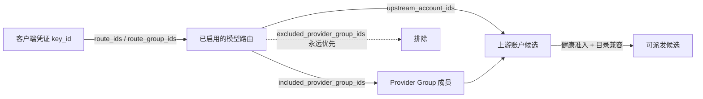

# 模型路由

模型路由决定「客户端请求的公开模型名」由哪些上游账户承接。授权是关系型的：模型权限不藏在模型名列表里，而是由凭证 → 路由 → 账户的显式授予链决定。

## 授权链

- 路由组（Route Group）是授权的集合：把一组路由整体授予凭证。
- Provider Group 是上游账户的集合：只有被路由显式 include 时才参与候选；exclusion 永远优先于直接账户和 include。
- 凭证组（Credential Group）不参与授权图。
- 候选始终绑定请求中的公开模型与协议；目录不兼容、已停用或未授权的账户不会成为候选。

## 创建路由

`POST /internal/v1/model-routes`（完整定义见 [model-route JSON Schema](https://github.com/memeloop-online/memeloop-token-center/blob/master/schemas/model-route.schema.json)）：

| 字段 | 说明 |
| --- | --- |
| `public_model` | 客户端可见的公开模型名 |
| `upstream_model` | 发往供应商的模型名；不在所选账户目录中时需 `custom_model_confirmed=true` |
| `protocol` | `openai`、`anthropic` 或 `generation` |
| `upstream_account_ids` | 候选账户（或用 `included_provider_group_ids`） |
| `priority` | 同模型多条路由时的优先级，默认 0 |

不再使用的路由用 `POST /internal/v1/model-routes/{route_id}/archive` 归档；历史请求的归属不受影响。

## 候选排序与账户偏好

网关在传输准备前解析出有界、已授权的候选集合。排序来自路由优先级与健康状态；账户「偏好」只能由已安装的流量策略插件在**已授权集合内**调整顺序——它不能增加账户、覆盖授予或强行启用不可用账户。客户端请求本身不能指定上游账户。

## 健康与故障转移边界

冷却和「是否允许重试」是两个独立决定：

- **可以换候选**：明确的 HTTP 429 拒绝、投递前确定的连接失败。
- **绝不重放**：派发后收到的 503、其他 5xx、输出帧错误、已产生可见输出、不确定的发送超时。已派发的请求无法证明供应商没有执行，盲目重试可能造成重复计费。

对原生 Codex 上游，结构化的 `usage_limit_reached` 429 会被识别为配额耗尽并按供应商给出的 `resets_at` / `Retry-After` 冷却（上限七天）；普通限流使用常规冷却。冷却期外的恢复通过单半开探针完成。

候选全部不可用且故障性质为临时不可用（`unavailable`）时，未发出的请求可以在原有 Deadline 内等待一次恢复；等待不会补充尝试次数或延长期限。已经消耗过出站尝试的请求不会进入等待。

## Codex 传输策略 `transport_policy`

原生 Codex 账户可以在 `config.transport_policy` 中调整连接与故障转移预算（版本 1，缺失 `version` 按 1 处理；未知字段与越界值会被拒绝）：

| 字段 | 默认 | 允许范围 |
| --- | --- | --- |
| `connect_attempts` | 2 | 1–4 |
| `connect_retry_delay_millis` | 150 | 0–2000 |
| `shared_probe_attempts` | 跟随服务健康设置 | 0–4 |
| `candidate_attempts` | 3 | 1–8 |
| `failover_deadline_millis` | 300000 | 1000–300000 |

通过既有的 `PUT /internal/v1/upstreams/{account_id}` 账户更新（CAS）修改。候选数与 Deadline 在请求入场时快照一次：备用配置和运行中的修改不会为已在执行的请求补充预算，Deadline 到期后不再发起新的发送，但成功准入的响应流不会被截断。

## 自定义模型的预留上限 `reservation_token_bounds`

请求执行前，网关会按价格与词元上限预留一笔余额；取得供应商完整用量后按实结算，预留金额不等于最终费用。

- 目录外的自定义模型必须配置精确的 `reservation_token_bounds`；缺失时该候选被跳过（在预留、归档或发送之前停止），不影响其他已授权候选。
- 取值依据只能是：同步的账户模型目录中**精确同名模型**的上限，或供应商确认的该模型输出限制。不要借用其他模型的上下文窗口或历史未知值。
- 目录只公布上下文窗口时，它只能作为保守预留界限，而不是供应商宣称的输出最大值。

## 插件路由

运营者还可以为 Provider Group / Route Group 选择已安装插件提供的路由策略（group-routing-v1 ABI），插件只对已授权候选做排序与有界的健康建议。协议细节见[插件：组路由](../plugins/routing.md)。
