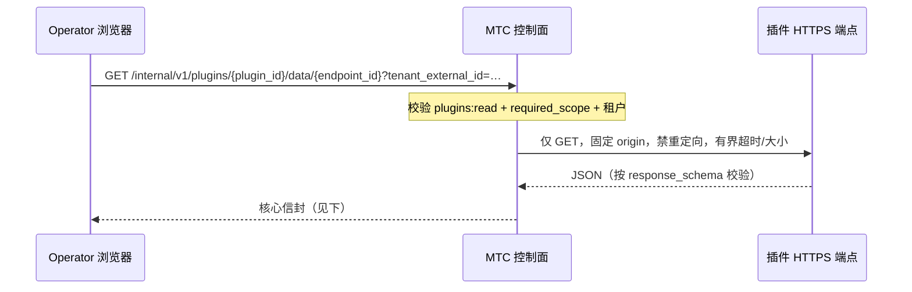

# Operator UI 扩展

插件可以在 Operator 控制台贡献一个侧栏页签或概览卡片，**无需提供任何浏览器代码**：清单声明数据来源与固定插槽，核心用受信的 `typed_data_v1` 渲染器把 JSON 渲染为本地组件。契约见[清单 Schema](https://github.com/memeloop-online/memeloop-token-center/blob/master/schemas/plugin-manifest.schema.json) 的 `contributions.service_data` 与 `contributions.operator_ui`，以及 [UI 投影 Schema](https://github.com/memeloop-online/memeloop-token-center/blob/master/schemas/plugin-ui-projection.schema.json)。

## 清单示例

```json
{
  "capabilities": [
    { "kind": "http", "allowed_origins": ["https://plugin-api.example.com"] }
  ],
  "contributions": {
    "service_data": [
      {
        "id": "health",
        "url": "https://plugin-api.example.com/v1/health",
        "required_scope": "metrics:read",
        "response_schema": {
          "type": "object",
          "additionalProperties": false,
          "required": ["status"],
          "properties": { "status": { "type": "string" } }
        },
        "fallback": { "status": "offline" },
        "cache_ttl_seconds": 30,
        "timeout_millis": 2000,
        "max_body_bytes": 65536
      }
    ],
    "operator_ui": [
      {
        "id": "health-tab",
        "slot": "operator.sidebar.tab",
        "category": { "id": "monitoring" },
        "route": "plugin-health",
        "label": "插件健康",
        "icon": "heart",
        "renderer": "typed_data_v1",
        "data_endpoint": "health"
      }
    ]
  }
}
```

要点：

- `service_data` 的 `url` 必须是完整 HTTPS GET 地址，且 origin 与某个 `http` capability 的 `allowed_origins` 精确匹配；`fallback` 必须通过 `response_schema` 校验，用于上游失败时保持界面可用。
- 插槽二选一：`operator.sidebar.tab`（侧栏页签，需 `route` 与分类——`monitoring`、`traffic`、`identity`、`system` 追加到核心分类，新分类需提供有界 `category.label`）或 `operator.overview.card`（概览卡片）。
- `icon` 只能取固定 token：`activity`、`chart`、`database`、`heart`、`plug`、`shield`；`data_endpoint` 必须指向同插件的 `service_data` id。
- `presentation` 可省略（通用键值视图）、`"health_intelligence_v1"`（核心三源健康紧凑视图）或 `"projection_v1"`（结构化投影，见下）。
- 加载期即拒绝：核心路由名、重复路由、冲突分类、任意图标名、未知数据端点；`settings` 与 `system-settings` 为核心保留。

## 数据流

浏览器从不直接访问插件 URL，而是调用核心代理端点：



MTC 不会把服务凭证、浏览器 token 或租户值转发给插件端点。响应始终是核心拥有的信封：

```json
{
  "data": { "status": "healthy" },
  "partial": false,
  "provenance": {
    "plugin_id": "example-observability",
    "endpoint_id": "health",
    "origin": "https://plugin-api.example.com",
    "fetched_at": 1780000000000,
    "source": "network"
  }
}
```

上游失败时 `partial: true` 且 `source` 为 `stale_cache` 或 `fallback`，`data` 仍保持 Schema 有效——因此请提供有意义、非敏感的 fallback。

## projection_v1 投影

选择 `"presentation": "projection_v1"` 时，端点数据需要是投影格式，`slot_id` 取贡献的 `id`：

```json
{
  "schema_version": 1,
  "plugin_id": "example-observability",
  "slot_id": "health-tab",
  "components": [
    { "kind": "metric", "label": "请求数", "value": "42" },
    { "kind": "status", "label": "状态", "state": "ok" },
    { "kind": "text", "text": "数据来自示例插件" },
    { "kind": "link", "label": "详情", "href": "https://plugin-api.example.com/dashboard" }
  ]
}
```

组件字段因 `kind` 而异：`text` 使用 `text`；`metric` 使用 `label` + `value`；`status` 使用 `label` + `state`（`ok`、`warning`、`error`、`unknown`）；`link` 使用 `label` + `href`（仅 HTTPS）。每个插槽最多 32 个组件。链接的 origin 必须来自已安装清单批准的 `http` capability，不能由投影数据自报。

## 安全边界

`typed_data_v1` 没有 iframe、远程 HTML、远程样式表、任意 JavaScript 或凭证透传：React 只用核心组件把 JSON 渲染为纯文本。安装/卸载只改变已加载的清单集合——卸载后该插件的页签、卡片与 `plugin--{plugin_id}--{route}` 路由在下一次清单刷新时全部消失，不会残留导航记录。
